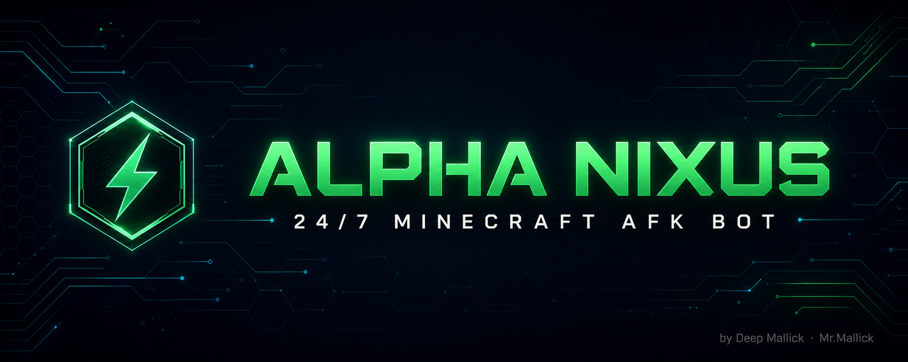

<div align="center">



<br>

**A production-grade 24/7 Minecraft AFK bot with human-like behaviour and rich Discord telemetry.**

<br>

[](https://github.com/mrdeep07k/alpha-nixus-bot/actions/workflows/ci.yml)
[](https://nodejs.org)
[](https://minecraft.net)
[](#-discord-webhook-logging)
[](docs/ARCHITECTURE.md)
[](package.json)
[](LICENSE)
[](https://github.com/mrdeep07k/alpha-nixus-bot/stargazers)

<br>

[**Features**](#-features) ·
[**Quick Start**](#-quick-start) ·
[**Discord Logs**](#-discord-webhook-logging) ·
[**Hosting**](docs/HOSTING.md) ·
[**Architecture**](docs/ARCHITECTURE.md) ·
[**Config**](#%EF%B8%8F-configuration)

<br>

`Crafted by` **Deep Mallick** — *AKA* **Mr.Mallick**

</div>

---

## 📖 Overview

**ALPHA NIXUS** ek lightweight, self-healing Minecraft bot hai jo tumhare server par **hamesha online** rehta hai — bilkul ek real player ki tarah behave karta hai, aur har activity ka **beautiful Discord report** bhejta hai.

Ek hi npm dependency, ~110 MB RAM, aur ~51 MB disk — matlab **256 MB ke free bot panel** par bhi aaram se chalta hai.

```
╔═══════════════════════════════════════════════════════════════╗
║  ✅ Never sleeps      🎭 Never predictable    📨 Never noisy  ║
║  🔁 Self-healing      🪪 Auto name rotation   🪶 Featherweight ║
╚═══════════════════════════════════════════════════════════════╝
```

---

## ✨ Features

<table>
<tr>
<td width="50%" valign="top">

### 🤖 Bot Core
- **24/7 presence** — kabhi nahi sota
- **Auto reconnect** — 2–5 s me wapas
- **Auto respawn** — mara to turant uthta hai
- **Smart auth** — `/register` ya `/login`, server ka chat padh kar khud decide
- **Username rotation** — `ALPHA_NIXUS1…5`, random jitter ke saath
- **Crash-proof** — `uncaughtException` par bhi zinda

</td>
<td width="50%" valign="top">

### 🎭 Human Simulation
- 8 alag random actions, **koi fixed loop nahi**
- Randomised delays (2.5 s – 11 s)
- Sprint, sneak, jump, hotbar, look-spin
- **Guaranteed anti-AFK pulse** har 20–45 s
- Optional occasional chat (default **OFF**)
- Rotation timing bhi jittered — pattern detect nahi hota

</td>
</tr>
<tr>
<td width="50%" valign="top">

### 📨 Discord Telemetry
- Rich embeds, **IST timestamps**
- Death reports — **kisne mara** wo bhi
- Kick reasons, crash traces, ban detection
- Live health / position / players / uptime
- **Anti-spam engine** — 100 events → 1 message
- Rate-limit (429) auto-handling

</td>
<td width="50%" valign="top">

### 🪶 Engineering
- **1 dependency** (`mineflayer`) — baaki sab native
- Auto storage cleanup: **426 MB → 15 MB**
- Memory guard for 256 MB panels
- Web dashboard + `/health` + `/logs`
- Docker / Fly.io / PM2 configs included
- CI on Node 18 · 20 · 22

</td>
</tr>
</table>

---

## 🚀 Quick Start

### Requirements
- Node.js **18+**
- Ek Minecraft server (offline/cracked mode, **1.12.1**)

### Install

```bash
git clone https://github.com/mrdeep07k/alpha-nixus-bot.git
cd alpha-nixus-bot
npm install
```

### Configure

```bash
cp .env.example .env
```

`.env` me kam se kam itna bharo:

```ini
MC_HOST=play.yourserver.net
MC_PORT=25565
MC_VERSION=1.12.1

AUTH_MODE=auto
AUTH_PASSWORD=ChangeThisPassword123
AUTH_DELAY_MS=4000
AUTH_RETRY_MS=6000

BOT_NAME_BASE=ALPHA_NIXUS
BOT_NAME_COUNT=5
ROTATE_HOURS=3

DISCORD_WEBHOOK=https://discord.com/api/webhooks/xxxx/yyyy

HUMAN_MODE=true
LOG_SERVER_CHAT=true
TZ_NAME=Asia/Kolkata
```

### Run

```bash
npm start
```

```
[slim] minecraft-data: 426.0 MB -> 14.5 MB ✅

╔══════════════════════════════════════════════════════════════╗
║ A L P H A   N I X U S   —  24/7 MINECRAFT AFK BOT            ║
╠══════════════════════════════════════════════════════════════╣
║ Creator  : Deep Mallick  (AKA Mr.Mallick)                    ║
║ Version  : 2.0.0   |   MC : 1.12.1                           ║
║ Target   : play.yourserver.net:25565                         ║
║ Names    : ALPHA_NIXUS1, ALPHA_NIXUS2, ALPHA_NIXUS3, …       ║
║ Discord  : ON (webhook logging)                              ║
╚══════════════════════════════════════════════════════════════╝

[03:45:59 am] [OK  ] Joined server as ALPHA_NIXUS1
[03:46:02 am] [OK  ] Auth complete (server confirmed)
[03:46:08 am] [OK  ] Movement engine STARTED (random human mode)
```

> 🌍 **Deploy karna hai?** → [**docs/HOSTING.md**](docs/HOSTING.md) me Oracle Cloud, bot panels, Fly.io, Docker aur PM2 — sab ke step-by-step guides hain.

---

## 📨 Discord Webhook Logging

Bot **kuch bhi locally save nahi karta** — poori telemetry seedha Discord par jaati hai.

<div align="center">

```
┌──────────────────────────────────────────────────────────────┐
│  📋 ALPHA NIXUS — Activity Report                            │
├──────────────────────────────────────────────────────────────┤
│  03:42:10 am  🚀 Bot start hua — target play.xyz:25565       │
│  03:42:11 am  ✅ ALPHA_NIXUS1 server par join ho gaya 🎉     │
│  03:42:13 am  🔑 Login successful — bot fully active         │
│  04:15:02 am  💀 ALPHA_NIXUS1 mar gaya — was slain by        │
│               Zombie  ·  Total deaths: 1                     │
│  05:03:44 am  📴 Connection toot gaya — socketClosed         │
│  05:03:47 am  ✅ ALPHA_NIXUS1 wapas join ho gaya 🎉          │
│  06:42:31 am  🪪 Username badla: ALPHA_NIXUS1 ➜ ALPHA_NIXUS2 │
├──────────────────────────────────────────────────────────────┤
│  🔌 Status         🌍 Server            ⏱️ Uptime            │
│  🟢 ONLINE         play.xyz:25565       2d 4h 11m            │
│  ALPHA_NIXUS2      Minecraft 1.12.1     Session: 33m         │
│                                                              │
│  ❤️ Health         📍 Position          👥 Players           │
│  HP 20/20          125.4, 64.0, -88.2   Online: 7            │
│  Food 20/20        overworld                                 │
│                                                              │
│  📊 Total Session Stats                                      │
│  ✅ Joins 4  •  🔄 Reconnects 3                              │
│  💀 Deaths 1  •  🚪 Kicks 0  •  🪪 Name changes 2            │
│                                                              │
│  🧾 Is report me                                             │
│  ✅ join 2  •  💀 death 1  •  📴 leave 1  •  🪪 rotate 1     │
│                                                              │
│  🖥️ RAM 108 MB  •  Node v20.11.0  •  Logs sent 41           │
├──────────────────────────────────────────────────────────────┤
│  ALPHA NIXUS • Deep Mallick (Mr.Mallick) • 24 Aug 2026 IST   │
└──────────────────────────────────────────────────────────────┘
```

</div>

### Tracked events

| | Event | Kya batata hai |
|:-:|---|---|
| 🚀 | **Boot** | Bot start hua, target server, kitne usernames ready |
| ✅ | **Join** | Kaunsa username, kab (IST) |
| 🔑 | **Auth** | Register/login safal hua ya nahi |
| 💀 | **Death** | **Kisne mara**, kaise mara, total deaths |
| 📴 | **Disconnect** | Kab tuta, kya wajah thi |
| 🚪 | **Kick** | Server ka poora reason + kya karna chahiye |
| 🪪 | **Rotation** | Naam kab, kis se kis me badla |
| ⚠️ | **Error** | Kya bug hai **+ fix ka hint** |
| 🔥 | **Crash** | Stack trace, recovery status |
| 🛑 | **Ban** | Ban detect hua (role ping ke saath) |

### 🚫 Anti-spam engine

| Mechanism | Default | Kaam |
|---|---|---|
| **Batching** | `LOG_FLUSH_SEC=120` | Events jama hote hain, ek embed me jaate hain |
| **Count trigger** | `LOG_FLUSH_COUNT=12` | Bahut events ho to jaldi bhejo |
| **Hard gap** | `LOG_MIN_GAP_SEC=45` | 2 messages ke beech minimum silence |
| **Critical bypass** | `LOG_INSTANT_CRITICAL=true` | Death / kick / crash turant |
| **Heartbeat** | `LOG_HEARTBEAT_MIN=60` | Kuch na ho to hourly "sab theek hai" |
| **Rate-limit guard** | built-in | Discord `429` par `retry_after` respect |

> 🧪 **Tested:** 13 consecutive failed reconnects produced only **2** Discord messages.

### Setup — 30 seconds

1. Discord channel → **Settings ⚙️ → Integrations → Webhooks → New Webhook**
2. **Copy Webhook URL**
3. `DISCORD_WEBHOOK=<url>` env me daalo
4. Restart — pehla report turant aayega ✅

> Webhook na do to bot bilkul theek chalega, logs sirf console me aayenge.

---

## ⚙️ Configuration

<details>
<summary><b>🌍 Minecraft &amp; Authentication</b></summary>

<br>

| Variable | Default | Description |
|---|---|---|
| `MC_HOST` | `localhost` | Server IP / hostname |
| `MC_PORT` | `25565` | Server port |
| `MC_VERSION` | `1.12.1` | Protocol version |
| `AUTH_PASSWORD` | `AlphaNixus@123` | Register/login password |
| `REGISTER_CMD` | `/register {pass} {pass}` | Custom register command |
| `LOGIN_CMD` | `/login {pass}` | Custom login command |
| `AUTH_DELAY_MS` | `6000` | Join ke baad auth delay |
| `AUTH_RETRY_MS` | `12000` | Retry interval |
| `AUTH_MAX_RETRY` | `4` | Max attempts (spam se bachne ke liye) |

</details>

<details>
<summary><b>🪪 Usernames &amp; Rotation</b></summary>

<br>

| Variable | Default | Description |
|---|---|---|
| `BOT_NAME_BASE` | `ALPHA_NIXUS` | Name prefix |
| `BOT_NAME_COUNT` | `5` | Kitne naam (1–10) |
| `BOT_NAMES` | – | Custom comma-separated list (overrides above) |
| `ROTATE_HOURS` | `3` | Rotation interval |
| `ROTATE_JITTER_MIN` | `25` | Random ± minutes (anti-pattern) |

</details>

<details>
<summary><b>🎭 Human Behaviour</b></summary>

<br>

| Variable | Default | Description |
|---|---|---|
| `HUMAN_MODE` | `true` | Movement engine on/off |
| `ACTION_MIN_MS` | `2500` | Min gap between actions |
| `ACTION_MAX_MS` | `11000` | Max gap between actions |
| `HUMAN_CHAT` | `false` | Occasional idle chat (**OFF = safest**) |
| `CHAT_EVERY_MIN` | `25` | Chat interval baseline |

</details>

<details>
<summary><b>📨 Discord Logging</b></summary>

<br>

| Variable | Default | Description |
|---|---|---|
| `DISCORD_WEBHOOK` | – | Webhook URL (khali = logging off) |
| `LOG_FLUSH_SEC` | `120` | Batch interval |
| `LOG_FLUSH_COUNT` | `12` | Flush after N events |
| `LOG_MIN_GAP_SEC` | `45` | Hard anti-spam gap |
| `LOG_HEARTBEAT_MIN` | `60` | Idle heartbeat interval |
| `LOG_INSTANT_CRITICAL` | `true` | Send critical events immediately |
| `LOG_BOT_NAME` | `ALPHA NIXUS` | Webhook display name |
| `LOG_AVATAR_URL` | – | Webhook avatar |
| `LOG_MENTION` | – | `<@&ROLE_ID>` to ping |
| `LOG_MENTION_ON` | `crash,ban` | Kin events par ping |
| `TZ_NAME` | `Asia/Kolkata` | Timezone for all timestamps |

</details>

<details>
<summary><b>🔧 Runtime</b></summary>

<br>

| Variable | Default | Description |
|---|---|---|
| `RECONNECT_MIN_MS` | `2000` | Min reconnect delay |
| `RECONNECT_MAX_MS` | `5000` | Max reconnect delay |
| `PORT` / `SERVER_PORT` | `3000` | Dashboard port (panels auto-set) |
| `KEEP_MC_VERSIONS` | `1.12,1.12.1,1.12.2,…` | Storage cleanup ke baad kaunse versions rakhne hain |

</details>

---

## 🌐 Endpoints

| Route | Response | Use case |
|---|---|---|
| `/` | HTML dashboard (auto-refresh 15 s) | Browser me status dekhna |
| `/health` | JSON | Uptime monitors, panel health checks |
| `/logs` | Plain text (last 150 lines) | Quick debugging |

---

## 📁 Project structure

```
alpha-nixus-bot/
├── index.js                  ⚡ Entry point + storage auto-cleanup
├── src/
│   ├── bot.js                🧠 Connection manager, auth, reconnect, rotation
│   ├── humanizer.js          🎭 Random movement engine
│   ├── discord.js            📨 Webhook queue + embed builder
│   ├── config.js             ⚙️  Env parsing + .env loader
│   ├── logger.js             📝 Console logging + IST helpers
│   └── web.js                🌐 Status dashboard
├── docs/
│   ├── HOSTING.md            🌍 Deployment guides
│   └── ARCHITECTURE.md       🏗️  Technical deep-dive
├── .github/workflows/ci.yml  ✅ CI (Node 18/20/22)
├── Dockerfile · fly.toml · ecosystem.config.js
└── .env.example
```

---

## 🛠️ Troubleshooting

<details>
<summary><b>Bot connect nahi ho raha</b></summary>

<br>

| Error | Wajah | Fix |
|---|---|---|
| `ECONNREFUSED` | Server band hai / port galat | `MC_PORT` verify karo |
| `ENOTFOUND` | Hostname resolve nahi hua | `MC_HOST` verify karo |
| `ETIMEDOUT` | Firewall / server hang | Server reachable hai? |
| `ECONNRESET` | Server ne kaat diya | Anti-bot plugin ho sakta hai |

</details>

<details>
<summary><b>Join karte hi kick ho jata hai</b></summary>

<br>

- **Version mismatch** — `MC_VERSION=1.12.2` try karo (bahut servers ViaVersion use karte hain)
- **Name already in use** — bot khud agla naam le lega; `BOT_NAME_COUNT` badha do
- **Whitelist** — server par bot ka naam whitelist me add karo

</details>

<details>
<summary><b>Bot hil nahi raha</b></summary>

<br>

1. `HUMAN_MODE=true` set hai? Console me warning aayegi agar nahi.
2. Console me `Movement engine STARTED` dikha? Nahi to `spawn` event nahi aaya — 20 s ka fallback apne aap chalega.
3. AuthMe login pending to nahi? Login hone tak server player ko freeze rakhta hai.
4. Bot AFK-cage / spawn protection me to nahi? Jump phir bhi hoga, position nahi badlegi.

</details>

<details>
<summary><b>Login / register fail ho raha hai</b></summary>

<br>

- `AUTH_PASSWORD` server ki password policy follow karta hai? (kuch plugins special char maangte hain)
- Custom auth plugin? `REGISTER_CMD` / `LOGIN_CMD` apne hisaab se set karo
- Console me `Password galat hai` aaya? Password badlo ya server par account reset karao

</details>

<details>
<summary><b>Storage / memory full</b></summary>

<br>

- Storage: pehli boot par auto-cleanup chalta hai (426 MB → 15 MB). `node_modules` delete karke restart karo.
- Memory: heap 200 MB par capped hai; RSS 210 MB cross kare to bot khud session refresh karta hai.
- Aur kam chahiye? `KEEP_MC_VERSIONS=1.12,1.12.1,1.12.2` set karo.

</details>

<details>
<summary><b>Discord logs nahi aa rahe</b></summary>

<br>

- Console me `Discord logging ON` dikhna chahiye — nahi dikha to `DISCORD_WEBHOOK` set nahi hai
- `Discord webhook fail: HTTP 401/404` → webhook delete ho gaya, naya banao
- Pehla message aane me `LOG_FLUSH_SEC` (default 120 s) tak lag sakta hai

</details>

---

## 🗺️ Roadmap

- [ ] Multi-bot support (ek process, kai servers)
- [ ] Discord slash-command control (`/status`, `/restart`)
- [ ] Auto `/kit` claim scheduler
- [ ] Prometheus metrics endpoint
- [ ] Microsoft account (premium) auth support

Koi idea hai? [Feature request kholo](https://github.com/mrdeep07k/alpha-nixus-bot/issues/new/choose) 💡

---

## 🤝 Contributing

Contributions welcome! [`CONTRIBUTING.md`](CONTRIBUTING.md) padho.

Quick rule: **zero new dependencies** jab tak bilkul zaruri na ho — bot ko 256 MB panels par chalna hai.

---

## ⚖️ Disclaimer

Ye tool **educational purposes** aur **apne khud ke servers** ke liye hai. Kisi server par bot chalane se pehle uske rules padho. Server rules todna, ban evade karna, ya kisi ko nuksan pahunchana — sab user ki apni zimmedari hai. Maintainer kisi bhi misuse ke liye responsible nahi.

---

## 📄 License

[MIT](LICENSE) © 2026 **Deep Mallick** (AKA **Mr.Mallick**)

---

<div align="center">

### ⚡ ALPHA NIXUS

**Built with precision by Deep Mallick — Mr.Mallick**

Agar ye project kaam aaya, to ek ⭐ zaroor de dena — motivation milti hai!

[](https://github.com/mrdeep07k/alpha-nixus-bot)

<sub>Made in India 🇮🇳</sub>

</div>
